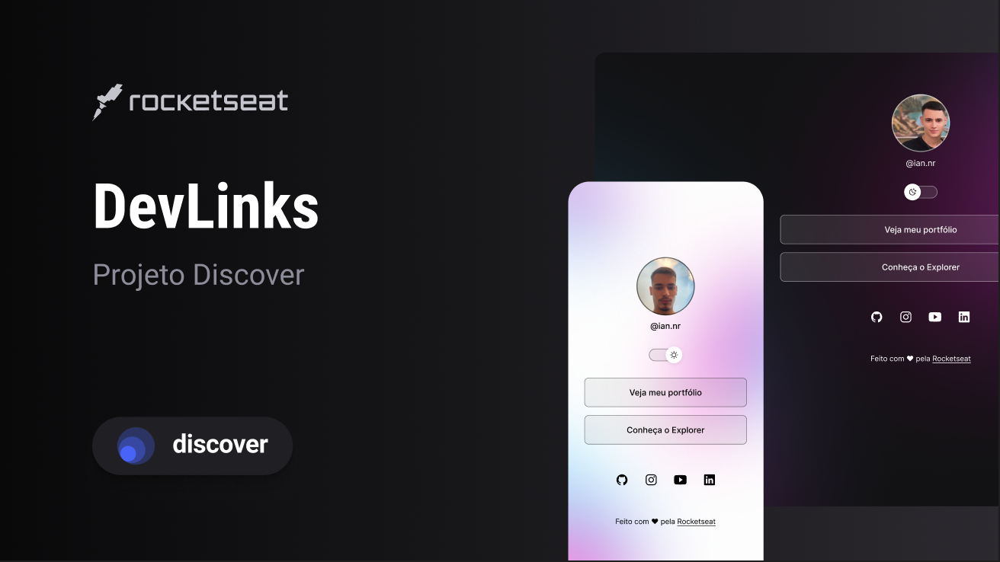

Seja bem vindo(a) ✨🚀

<h1 align="center">DevLinks</h1>
<h3 align="center">Trilha Discover - Rocketseat</h3>

  <a href="#-sobre">Sobre</a>&nbsp;&nbsp;&nbsp;|&nbsp;&nbsp;&nbsp;
  <a href="#-tecnologias">Tecnologias</a>&nbsp;&nbsp;&nbsp;|&nbsp;&nbsp;&nbsp;
  <a href="#-layout">Layout</a>&nbsp;&nbsp;&nbsp;|&nbsp;&nbsp;&nbsp;
  <a href="#-considerações">Considerações</a>&nbsp;&nbsp;&nbsp;|&nbsp;&nbsp;&nbsp;
  <a href="#-licença">Licença</a>

  

<h3>📌 Sobre</h3> 

DevLinks é um agregador de links/portfólio, que possui a funcionalidade de trocar de tema(Dark e Light), além de ser responsivo!

<h3>📌 Tecnologias</h3> 

- HTML, CSS, JavaScript;
- Git;
- Figma;

<h3>📌 Layout</h3>

Você pode visualizar o layout do projeto através [DESSE LINK](https://www.figma.com/community/file/1187422022288947321). É necessário ter conta no [Figma](https://figma.com) para acessá-lo.

<h3>📌 Considerações</h3> 

Gostei muito do projeto ele fixou muito meus conhecimentos e me ajudou a desenvolver mais minhas noções de programação.

<h3>📌 Licença</h3>

Esse projeto está sob a licença MIT.
